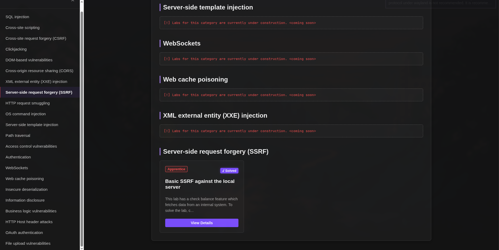
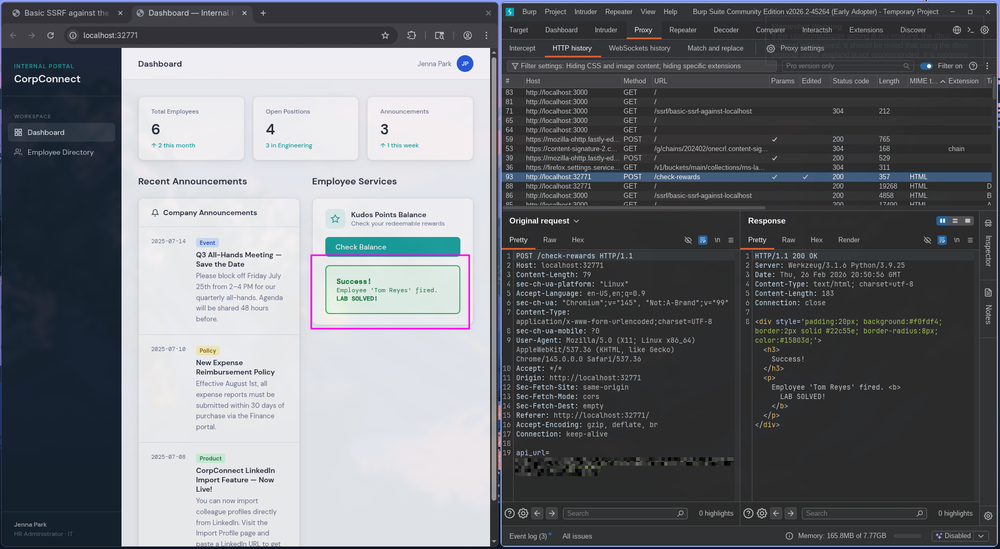

# Web Security Home Labs

A self-hosted platform for spinning up and solving containerized web security labs — built to deepen my understanding of real-world vulnerabilities by recreating challenges from PortSwigger Web Security Academy.

---

## What is this?

This project is my personal lab environment. The idea is simple: take the web security labs and CTFs I've worked through on PortSwigger Academy, recreate them, and make them available locally through a clean management interface. Every lab I add to this platform is one I've already solved — so the recreations are informed by actually understanding the vulnerability, not just following a guide.

The **Control Panel** is a Node.js/Express app that handles the UI and API. The **labs themselves** are isolated Docker containers, built with whatever technology fits the vulnerability being demonstrated (Python/Flask, etc.).


---
## Example SSRF lab


---
## Architecture

| Component | Technology | Role |
|---|---|---|
| Control Panel | Node.js / Express | UI, dashboard, and API endpoints |
| Container Orchestration | Dockerode | Programmatically spins up and tears down lab instances |
| State Management | `better-sqlite3` | Tracks solved labs persistently |
| Lab Environments | Docker (Python/Flask, etc.) | Isolated, containerized vulnerabilities |
| Instance Reporting | Webhooks | Real-time exploit confirmation back to the control panel |

---

## Prerequisites

- **[Node.js](https://nodejs.org/)** v18.x or higher
- **[Docker](https://www.docker.com/)** (Docker Desktop on Windows/macOS, Docker Engine on Linux)
- **npm** (bundled with Node.js)

---

## Getting Started

**1. Clone the repository**
```bash
git clone https://github.com/Weave7/Web-security-home-labs.git
cd Web-security-home-labs
```

**2. Install Control Panel dependencies**
```bash
npm install
```

**3. Build the lab Docker image**
```bash
# Navigate to the relevant lab directory and build its image
docker build -t corpconnect-lab:latest .
```

**4. Start the platform**
```bash
npm start

# Or with hot-reload for development:
npm run dev
```

The Control Panel will be available at `http://localhost:3000`.

---

## 🐧 Linux Users — Firewall Note

If you're on Linux with an active firewall (e.g. UFW), Docker's internal network may be blocked from sending webhooks back to the host. You'll need to open port 3000 to allow lab containers to report back to the Control Panel:

```bash
sudo ufw allow 3000
```

> On Windows and macOS, Docker Desktop handles this automatically.

---

## 🗺️ Roadmap

- [ ] **Docker Compose integration** — move the Control Panel itself into a container for zero-config networking (Docker-outside-of-Docker)
- [ ] **More lab categories** — Blind SQLi, RCE, XXE, CSRF, Privilege Escalation, and beyond

---

*Built to learn. Every lab here is one I've broken.*
